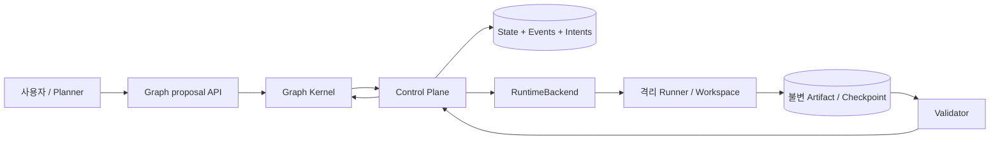
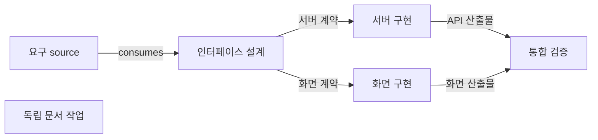
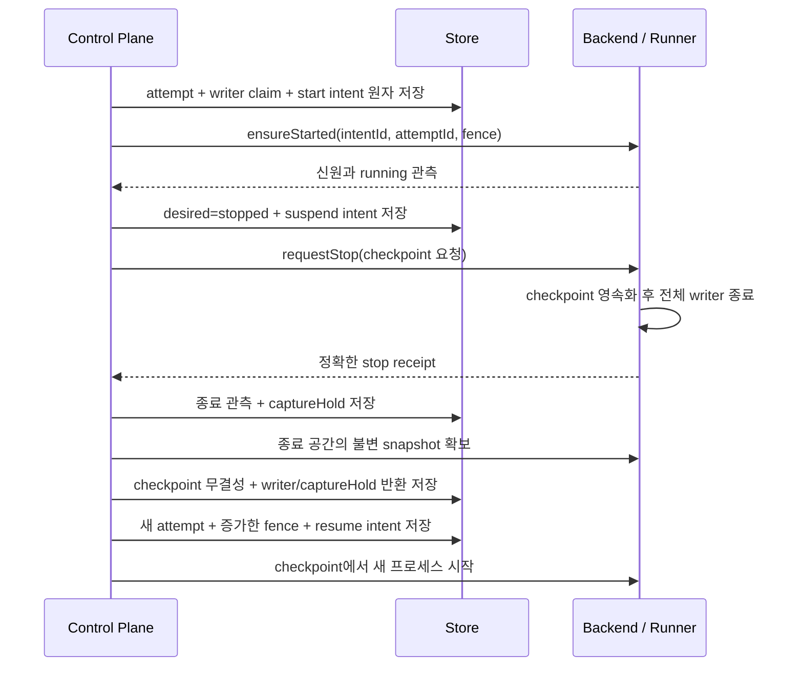

# 계약 위의 신규 설계

상태: 검토 초안 · 규범: [C01–C12](contracts.md)

C01–C12의 논리 경계는 유지한다. 2026-09-27부터 실행 기반은 [AX 원본 우선 도입 설계](ax-implementation-adoption.md)를 따른다. Go·gRPC·Redis Streams·Substrate·원본 runner를 사용하며, 아래 추상 경계를 이유로 AX 내부를 재작성하지 않는다. 그래프와 결과 유효성은 AX 위에 추가한다.

## 1. 네 경계와 단방향 의존



그림의 화살표는 실행 중 데이터 흐름이다. 코드 의존은 아래 방향만 허용한다. kernel이 control plane이나 실행 backend를 import하는 순환은 허용하지 않는다.

| 경계 | 소유 책임 | 의존 가능 대상 |
|---|---|---|
| Contracts | 객체 schema, 참조·digest 규칙, 명령/이벤트, 포트의 의미 | 외부 제품에 의존하지 않음 |
| Graph Kernel | graph 검증, 준비 조건, 영향 계산, 증거에 따른 재사용·재작업 결정 | Contracts |
| Control Plane | 트랜잭션, operation 중복 제거, 명령 권한, intent 전달, 관측 수집, 결과 채택 | Contracts, Graph Kernel, 포트 인터페이스 |
| Adapters | 저장소, 실행 backend, runner, artifact/checkpoint 보관, 검증기, planner | Contracts의 포트; kernel 상태 직접 수정 금지 |

### 저장할 원본과 계산할 값

원본은 불변 계약/spec/graph revision, artifact·checkpoint·검증 manifest, attempt 이력, 명령 처리 기록, 이벤트, 실행 intent다. 현재 revision 포인터와 writer 점유는 트랜잭션으로 갱신한다.

실행 준비 여부, 영향 경로, group 완료 여부는 위 원본에서 계산한다. 계산 결과를 캐시할 수는 있지만 캐시가 새로운 그래프 원본이 되지 않는다. relation 의미를 다른 계층에서 추가하지 않는다.

실행 상태와 결과 유효성을 같은 enum에 섞지 않는다.

```text
Execution observed: queued / starting / running / stopping / stopped / unknown
Result validity:    absent / valid / check_required / invalid / retired
Task eligibility:   derived from current inputs + after edges + policy + writer state
```

`stopped + valid`는 채택된 결과가 있는 종료 실행이다. `stopped + check_required`는 실행은 끝났지만 변경된 조건에서 결과를 다시 판단해야 한다는 뜻이다. 중단된 작업의 checkpoint가 유효하다는 것과 업무 결과가 유효하다는 것은 별개다.

### 계획과 실행의 책임

Planner는 목표를 leaf·group·포트·integration으로 분해한 proposal과 근거를 만든다. 정적 검증기는 참조·순환·포트 연결·완료 조건을 검사한다. 계약 의미와 책임 분해에 대한 검토 증거도 proposal에 첨부한다. 결정적 규칙이 자연어 의미를 완전히 판정한다고 주장하지 않는다.

검증된 proposal만 활성화한다. activation은 사용자가 허용한 작업 범위 안에서 수행하며, 권한 확대나 불확실한 요구는 별도 결정 대상으로 남긴다. 모든 plan에 추가 사용자 승인 절차를 강제한다는 뜻은 아니다.

## 2. 변경은 영향 후보와 실제 재작업을 나눠 처리한다

### 그래프 예시



서버 출력 변경이 확정되고 화면 출력의 보존 증거가 있으면 서버 구현과 통합 검증만 영향 후보가 된다. 화면 포트의 이름이나 계약이 같다는 사실만으로는 보존 증거가 되지 않는다. 설계 spec이 바뀌어 새 출력이 아직 미확정이면 서버와 화면 결과를 모두 후보로 둔다. 독립 문서 작업은 어느 경우에도 데이터 경로가 없으므로 영향을 받지 않는다.

### 변경 처리 알고리즘

1. **변경 후보 계산:** proposal의 기준 graph revision과 활성 revision을 비교한다. spec 의미, 입력 binding, 순서 조건, 계약·환경·정책·검증기 차이를 계산한다. 영향 원인을 출력 포트별로 기록한다.
2. **원자적 적용:** 새 graph를 활성화하면서 영향 결과를 `check_required`로 바꾸고, 영향받은 실행을 fence하며, 중단 intent를 같은 트랜잭션에 기록한다. 이전 workspace의 종료를 기다리는 동안 새 명세 실행을 시작하지 않는다.
3. **위상 순서 판정:** 필요한 상위 artifact가 확정되면 `C06`의 `reuse/revalidate/rerun/wait` 중 하나를 선택한다. 새 입력과 기존 출력의 검증은 별도 격리된 validator 실행에서 수행한다.
4. **후속 후보 해소:** 재사용 또는 새 출력이 채택되면 그 digest를 기준으로 직접 소비자부터 판정한다. 현재 graph의 필수 target이 모두 유효해질 때 전체 완료를 기록한다.

전파는 후보 표시와 실행 예약을 분리한다. 후보가 되었다는 이유로 모든 하위 leaf를 즉시 다시 실행하지 않는다. 중단된 실행을 재개하더라도 새 attempt가 현재 입력을 고정한다.

`after`만 연결된 후행 작업은 선행 작업의 새 출력 때문에 기존 결과를 폐기하지 않는다. 다만 아직 시작하지 않은 후행 작업은 선행 작업의 현재 완료 증거가 없으면 대기한다. 후행 작업 자신의 순서 조건이 바뀐 경우는 새로운 실행 의미이므로 별도로 판정한다.

### 결과 채택의 경쟁 조건

candidate 업로드는 결과 채택이 아니다. 새 실행 결과의 `fresh` 채택에서는 검증된 manifest를 받은 후 아래를 같은 트랜잭션에서 검사한다.

```text
activeGraphRevision == candidate의 채택 대상 revision
currentTaskSpec == candidate.taskSpecRef
currentBindings == candidate의 입력 snapshot
currentAttempt == candidate.attemptId
currentFence == candidate.fence
attempt가 취소·대체되지 않았음
정확한 writer의 종료와 모든 필수 검증이 확인됨
```

경합으로 하나라도 달라지면 candidate를 이력에 보관한다. `reuse/revalidate` 채택은 원 실행을 현재 attempt로 바꾸지 않는다. 현재 입력 snapshot과 원 결과를 연결하는 AdoptionRecord를 새로 만들고, 의미적 재사용 key·순서 의무·무결성·동일성 또는 재검증 증거를 검사한다.

무관한 graph 변경 중 실행을 마친 경우에도 자동 폐기하지 않는다. 현재 graph에 대한 명시적인 새 채택 판정을 통해 의미가 같음을 증명하면 결과를 사용할 수 있다. 원본 provenance digest는 유지한다. 늦은 callback 자체에는 현재 포인터를 갱신할 권한이 없다.

## 3. 실행·중단·복구를 하나의 수명 계약으로 연결한다

### backend 포트

| 포트 호출 | 입력 핵심 | 필수 결과 |
|---|---|---|
| `ensureStarted` | intentId, attemptId, fence, 고정 launch spec | 동일 intent의 안정된 backendHandle 또는 확인 불가 |
| `observe` | intentId, attemptId, fence, 선택적 backendHandle | handle 없이 생성 여부 조회; 정확한 신원의 관측과 종료 증거; 소실은 unknown |
| `requestStop` | intentId, 신원, stopReason, checkpoint 요구 | 미생성 intent는 확정 철회하고 tombstone 보존; 생성된 실행은 중단 요청 후 observe로 확인 |
| `captureStoppedWorkspace` | 종료 증거, workspaceId | 무결성 있는 불변 snapshot 또는 실패 |

제어기가 호출할 수 있는 포트이며 worker에게 backend 관리 권한을 주지 않는다. 플랫폼별 상태명은 어댑터 내부에서 이 계약으로 변환한다. start 응답을 받지 못하면 intentId로 조회한다. 취소된 intent에 뒤늦은 ensureStarted가 도착해도 생성하지 않는다. 새 ID를 발급해 중복 실행하지 않는다.

### 정상 실행과 재개



runner가 checkpoint를 쓰기 전에 종료됐다면 파일이 남아 있어도 안전한 재개 지점이 있다고 추정하지 않는다. 이전 검증된 checkpoint 또는 깨끗한 입력에서 다시 시작할 수 있는지 effectPolicy로 판단한다.

환경 초기화는 template digest와 공간의 bootstrap marker를 비교해 한 번 수행한다. 환경이 바뀌면 새 공간을 만들고 명시적인 artifact/checkpoint만 가져온다. 이전 공간을 암묵적으로 새 환경으로 변형하지 않는다.

### 저장과 복구

초기 제어는 graph 단위의 직렬화된 명령 처리를 기준으로 설계한다. 하나의 프로세스만 믿는 대신 저장소 revision 비교와 backend 신원으로 중복 실행을 방지한다. 추후 여러 제어기에서도 같은 계약을 유지해야 한다.

state와 intent를 저장한 뒤 backend를 호출하고, 호출 결과를 다시 저장한다. 이 사이 어느 지점에서 죽어도 pending intent와 backend 신원으로 이어간다. 알림은 진행을 빠르게 하는 수단이며 복구의 유일한 근거가 아니다.

| 장애 지점 | 저장된 근거 | 복구 동작 |
|---|---|---|
| 시작 응답 유실 | start intent와 attempt 신원 | 같은 intent로 조회·재전달; 중복 writer 금지 |
| 중단 지연·관측 단절 | desired=stopped와 마지막 관측 | unknown/대기 유지; 종료 증명 전 공간 인계 금지 |
| snapshot 또는 검증 실패 | 종료 증거와 미채택 candidate | 실행 성공으로 표시하지 않고 snapshot·검증 단계부터 복구 |
| 외부 효과 결과 불명 | effect intent와 확정되지 않은 receipt | 자동 반복 중지; 결과 확인 또는 명시적 결정 대기 |

ArtifactStore와 CheckpointStore는 상태 DB 밖에 있어도 된다. bytes를 먼저 불변 저장하고 무결성을 확인한 다음 DB에 참조를 채택한다. 참조 없는 임시 업로드는 이후 정리할 수 있지만, DB에 채택된 bytes가 사라지면 관련 결과를 유효한 것으로 취급하지 않는다.

## 4. 수용 시나리오와 검토 경계

아래 ID는 구현 태스크의 완료 조건에서 참조한다. 실패 경로의 관측 결과까지 수용 기준에 포함한다.

### 분해와 계약

- **A01 — 잘못된 그래프 거절:** 순환, 없는 포트, 중복 생산자, group 실행 의존, 누락된 필수 입력, 완료 target 없음은 전체 activation을 거절한다. 활성 revision과 실행 intent는 바뀌지 않는다.
- **A02 — 작은 작업의 완료:** 분리된 두 leaf가 통과해도 필수 integration leaf가 실패하면 group은 완료되지 않는다. planner가 책임·검증을 빠뜨린 proposal도 활성화되지 않는다.
- **A03 — 명세 고정:** 실행 중 계약·요구·환경·검증기가 바뀌어도 기존 attempt의 snapshot과 이력은 변하지 않는다. 새 작업은 새 참조와 attempt를 사용한다. source artifact는 등록 출처·검증 증거로 leaf 입력에 연결되며 가짜 attempt를 요구하지 않는다.
- **A04 — 증거 없는 성공 거절:** 종료 코드 0 또는 worker의 성공 주장만 제출하면 결과를 채택하지 않는다. 출력 누락·무결성 오류·검증 실패도 같다.

### 변경과 선택적 재작업

- **A05 — 포트별 영향:** A가 x/y를 출력하고 B는 x, C는 y를 소비할 때, x 변경 확정과 y 보존 증거가 있으면 B와 B의 소비 경로만 후보로 만든다. 독립 D와 C는 유지한다. A의 새 spec 출력이 미확정이면 B와 C를 모두 후보로 둔다.
- **A06 — 전파 중단:** A→B→C에서 A를 재수행한 뒤 B의 새 입력이 기존과 동일하면 B를 재사용한다. B의 결과가 같다는 증거로 C도 재사용한다. 입력이 달라지면 명시적인 호환성 검증 또는 재작업을 수행한다. 동일 bytes의 새 artifact ID와 무관한 graph revision 변경은 별도 AdoptionRecord로 연결되며 원본 이력을 바꾸지 않는다.
- **A07 — 순서와 데이터 분리:** `after(predecessor=A, successor=B)`에서 A의 출력 변경만으로 완료된 B를 무효화하지 않는다. 아직 시작하지 않은 B는 현재 A 완료 증거를 기다린다. B 완료 뒤 새 선행 작업이 추가되면 입력이 같아도 새 순서 의무를 만족했다는 증거 없이 재사용하지 않는다.
- **A08 — 늦은 결과 차단:** 영향 후보 표시와 동시에 이전 attempt를 fence한다. 옛 결과가 변경 적용·중단·재개와 경합해도 현재 결과 포인터를 덮지 못한다.

### 격리와 재개

- **A09 — 실제 격리:** 실제 backend에서 A의 writer가 B의 가변 공간, 읽기 전용 입력, 제어 평면 저장소를 수정하지 못한다. 허용하지 않은 network/secret 접근도 거절된다.
- **A10 — 중단 경합:** stop 요청 직후 resume를 호출해도 이전 writer의 종료 증거와 필요한 snapshot 확보가 끝나기 전에는 새 writer가 시작되지 않는다. 종료 후 capture 도중 새 writer를 요청해도 대기한다. lease 만료·자원 소실도 우회 경로가 되지 않는다.
- **A11 — 체크포인트 재개:** 실제 프로세스를 중단하고 새 프로세스로 재개한다. 영속 파일·완료 단계·에이전트 세션이 보존되고 초기화가 덮어쓰지 않는다. 변경된 입력의 완료 단계는 무조건 생략하지 않는다.
- **A12 — 안전하지 않은 재개 거절:** checkpoint 손상, 부분 쓰기, 외부 효과의 응답 유실은 자동 성공·자동 반복으로 처리하지 않는다. 성공 receipt는 호출 생략으로 연결하고 미확정 효과는 수신자의 중복 제거 보장이 없으면 반복하지 않는다. 원인과 필요한 결정을 조회할 수 있다.

### 지속성과 복구

- **A13 — 명령 경합:** 동일 operationId·동일 payload는 같은 결과를 반환한다. 다른 payload는 거절한다. 같은 baseRevision을 겨냥한 두 변경은 하나만 활성화된다.
- **A14 — 제어기 장애 복구:** intent 저장 전후, backend 생성 직후, 종료 관측·snapshot 확보 사이에 제어기를 강제 종료한다. 재시작 후 실행 중복 없이 상태를 수렴시킨다. handle 없는 intent 철회 뒤 지연된 시작 전달도 새 실행을 만들지 못한다.
- **A15 — 증거 보존:** artifact 업로드와 DB 채택 사이 장애, 이벤트 중복·연결 단절을 주입한다. 채택한 결과의 bytes와 근거가 조회되며 이벤트 cursor로 이어 읽을 수 있다. 참조된 bytes가 없으면 유효 결과로 제공하지 않는다.
- **A16 — 전체 시나리오:** 목표 분해→병렬 독립 실행→중단/재개→입력 변경→영향 경로만 재작업→통합 검증→완료를 실제 backend에서 수행하고 각 판정의 증거를 연결한다.

### AX 기반 적합성 검증

`T02`는 고정한 AX Go·Redis·Substrate 기반에서 RuntimeBackend·StateStore·ArtifactStore·CheckpointStore 계약의 적합성을 확인한다. C07–C10의 필수 capability를 실제 검증하고, 지원하지 못하는 요구는 [지원 범위](../../engine/extensions.md)에 명시한다. 원본 구현을 우선 사용하고 불가피한 차이만 확장한다.

첫 작업 에이전트는 현재 ChatGPT 로그인을 사용하는 Codex CLI다. UI, 다중 지역 운영, 자동 비용 최적화는 현재 요구로 확정하지 않는다. 자연어 계획 품질과 모델 성능은 결정적 계약 테스트의 통과만으로 보장하지 않는다.
