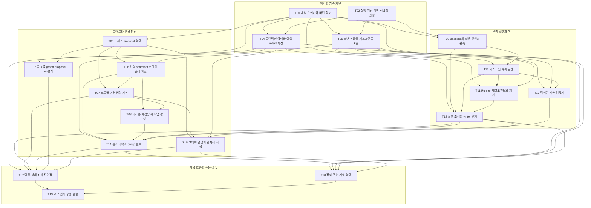

# 신규 구현 태스크 그래프

상태: 계약 전체의 목표 DAG · 실제 구현 상태와 구분

이 문서는 [graph.json](graph.json)에서 생성한다. 입력 포트가 가리키는 산출물에서 의존성을 도출하며, 별도의 의존성 목록을 수작업으로 유지하지 않는다. 제품 실행용 GraphRevision payload가 아닌 구현 작업의 검토용 DAG다.

## 1. 계약을 먼저 고정하고 독립 경로를 병렬 구현한다

T01은 계약을 기계적으로 검증 가능한 schema로 만들고, T02는 고정한 AX Go·Redis·Substrate 기반이 계약을 충족하는지 판단한다. 이 DAG는 계약 전체의 논리 작업 분해다. 실제 구현 경계와 완료 근거는 [AX 도입 설계](ax-implementation-adoption.md)와 [구현 상태](implementation-status.md)를 따른다.



화살표는 선행 작업의 산출물을 소비한다는 뜻이다. 작업 의존성이 코드의 import 의존성을 강제하지는 않는다. 예를 들어 kernel은 adapter의 계약·검증 fixture를 참고하더라도 adapter 구현을 import하지 않는다. 계약·설계·AX 참고 문서 source 연결은 가독성을 위해 그림에서 생략했으며 JSON과 아래 입력 목록에는 모두 포함한다.

## 2. 각 작업은 입력·산출물·소유 범위·완료 증거를 가진다

`capability:` 소유 범위는 파일 경로가 아닌 논리 책임 식별자다. AX의 기존 확장 지점과 원본 구현을 사용하며, 각 책임마다 새 디렉터리나 자체 실행기를 만들지 않는다. 동일 책임의 중복 소유는 검증기가 거절한다.

### 계약과 영속 기반

**T01 — 계약 스키마와 버전 참조**

불변 객체와 명령을 같은 schema로 표현하고 정확한 참조·digest 규칙을 고정한다.

- 입력: `S-CONTRACTS/contracts`
- 산출물: `T01/schema-package` · 소유 범위: `capability:contract-schema`
- 계약: C01, C02, C03, C08, C09, C10, C11, C12 · 수용 시나리오: A03, A13
- 완료 증거: 계약 필수 필드·열거값·참조 종류와 canonical digest 규칙이 검증된다. 잘못된 참조·누락·비결정적 digest fixture를 거절한다.

**T02 — 실행·저장 기반 적합성 결정**

고정한 AX Go·Redis·Substrate 기반에서 계약의 필수 capability와 지원 범위를 실제 검증한다.

- 입력: `S-CONTRACTS/contracts`, `S-DESIGN/architecture`, `S-AX/reference`
- 산출물: `T02/platform-decision` · 소유 범위: `capability:platform-decision`
- 계약: C07, C08, C09, C10, C11 · 수용 시나리오: A09, A10, A14
- 완료 증거: 선정 근거와 지원·미지원 capability, 신뢰 경계, 개발 환경 준비 방법을 기록한다. writer 종료 증명·멱등 생성·원자 저장·snapshot 보존을 확인하는 작은 실행 증거를 남긴다.

**T04 — 트랜잭션 상태와 실행 intent 저장**

상태·이벤트·명령 중복 제거·outbox intent를 하나의 원자적 저장 경계로 제공한다.

- 입력: `T01/schema-package`, `T02/platform-decision`
- 산출물: `T04/state-store` · 소유 범위: `capability:state-store`
- 계약: C08, C10, C12 · 수용 시나리오: A13, A14, A15
- 완료 증거: revision 경합에서 하나만 반영되고 동일 operation은 이전 결과를 반환한다. 장애 후 미처리 intent와 event cursor를 복구한다.

**T05 — 불변 산출물·체크포인트 보관**

bytes와 manifest를 digest로 검증하고 채택 후 변경되지 않는 보관 포트를 제공한다.

- 입력: `T01/schema-package`, `T02/platform-decision`
- 산출물: `T05/snapshot-store` · 소유 범위: `capability:snapshot-store`
- 계약: C03, C07, C09 · 수용 시나리오: A04, A12, A15
- 완료 증거: 부분 업로드와 digest 불일치를 채택하지 않는다. 채택된 참조의 보존과 참조 없는 임시 업로드의 정리를 구분한다.

### 그래프와 변경 판정

**T03 — 그래프 proposal 검증**

leaf·group·source와 포트 연결을 검증하고 잘못된 graph 전체를 거절한다.

- 입력: `T01/schema-package`, `S-DESIGN/architecture`
- 산출물: `T03/graph-validator` · 소유 범위: `capability:graph-validation`
- 계약: C01, C02, C04 · 수용 시나리오: A01, A02
- 완료 증거: contains forest와 consumes+after DAG를 검사한다. 필수 입력·계약·완료 target·분해 검토 증거의 누락을 거절한다.

**T06 — 입력 snapshot과 실행 준비 계산**

현재 graph에서 leaf의 정확한 입력과 준비 여부를 계산한다.

- 입력: `T03/graph-validator`, `T05/snapshot-store`
- 산출물: `T06/input-resolver` · 소유 범위: `capability:input-resolution`
- 계약: C02, C03, C04 · 수용 시나리오: A01, A03, A07
- 완료 증거: 실행 도중 입력을 latest로 바꾸지 않는다. consumes와 after의 대기 이유를 구분하여 반환한다.

**T07 — 포트별 변경 영향 계산**

변경 원인을 직접 소비 포트에서 후속 경로로 전파하고 영향 후보를 산출한다.

- 입력: `T03/graph-validator`, `T06/input-resolver`
- 산출물: `T07/impact-analyzer` · 소유 범위: `capability:impact-analysis`
- 계약: C04, C05 · 수용 시나리오: A05, A07, A08
- 완료 증거: 변경 포트의 소비 경로만 check_required 후보로 표시한다. 독립 경로·단순 group 이동은 유지하고 각 후보의 원인 경로를 남긴다.

**T08 — 재사용·재검증·재작업 판정**

확정된 입력과 증거를 비교해 reuse/revalidate/rerun/wait 결정을 계산한다.

- 입력: `T06/input-resolver`, `T07/impact-analyzer`
- 산출물: `T08/rework-decider` · 소유 범위: `capability:rework-decision`
- 계약: C03, C05, C06 · 수용 시나리오: A05, A06
- 완료 증거: 동일 content라도 계약·환경·정책·검증기가 달라지면 무조건 reuse하지 않는다. 명시적 호환성 검증 결과가 불확실하면 성공으로 판정하지 않는다.

**T14 — 결과 채택과 group 완료**

검증된 결과만 현재 graph에 원자적으로 채택하고 완료 target을 집계한다.

- 입력: `T04/state-store`, `T06/input-resolver`, `T08/rework-decider`, `T12/execution-controller`, `T13/validation-service`
- 산출물: `T14/result-adopter` · 소유 범위: `capability:result-adoption`
- 계약: C01, C03, C04, C05, C06, C08, C10 · 수용 시나리오: A02, A04, A08, A15
- 완료 증거: 늦은 결과·변경된 입력·다른 fence의 결과가 현재 포인터를 갱신하지 못한다. 부분 출력·실패한 integration을 전체 완료로 표시하지 않는다.

**T15 — 그래프 변경의 원자적 적용**

검증된 graph 변경과 결과 유효성 철회·fencing·중단 intent를 한 트랜잭션에서 적용한다.

- 입력: `T03/graph-validator`, `T07/impact-analyzer`, `T04/state-store`, `T12/execution-controller`
- 산출물: `T15/graph-activation-service` · 소유 범위: `capability:graph-activation`
- 계약: C04, C05, C08, C10, C11 · 수용 시나리오: A01, A05, A08, A13, A14
- 완료 증거: 활성 revision·결과 철회·attempt fence·stop intent가 모두 적용되거나 모두 적용되지 않는다. 계획 활성화와 늦은 결과 채택이 경합해도 이전 결과가 새 graph를 덮지 못하며 무관한 경로는 유지한다.

**T16 — 목표를 graph proposal로 분해**

목표를 작은 책임과 계약·검증을 가진 leaf들로 제안하는 planner 포트를 제공한다.

- 입력: `T01/schema-package`, `T03/graph-validator`, `S-REQUIREMENTS/requirements`
- 산출물: `T16/planner-adapter` · 소유 범위: `capability:planner-adapter`
- 계약: C01, C02, C04, C11 · 수용 시나리오: A01, A02, A16
- 완료 증거: planner는 저장소·backend를 직접 변경하지 않는다. 고정된 fixture 목표에서 포트·책임·검증·integration이 있는 proposal을 만들고 오류 시 보완한다.

### 격리 실행과 복구

**T09 — Backend의 실행 신원과 관측**

선정 기반에 ensureStarted/observe/requestStop 포트를 구현한다.

- 입력: `T01/schema-package`, `T02/platform-decision`
- 산출물: `T09/runtime-backend` · 소유 범위: `capability:runtime-backend`
- 계약: C07, C08, C10 · 수용 시나리오: A10, A14
- 완료 증거: 응답 유실 뒤 동일 intent가 동일 backend 자원을 가리킨다. 정확한 writer의 종료 증거와 관측 불명 상태를 구분한다.

**T10 — 태스크별 격리 공간**

template으로 독립 공간을 준비하고 읽기 전용 입력과 실행 권한을 집행한다.

- 입력: `T05/snapshot-store`, `T09/runtime-backend`
- 산출물: `T10/workspace-provider` · 소유 범위: `capability:workspace-provider`
- 계약: C07, C08 · 수용 시나리오: A09, A10
- 완료 증거: 동시 writer와 다른 태스크 공간 접근을 실제 backend에서 차단한다. 미지원 network·secret·resource 정책은 시작 전에 거절한다.

**T11 — Runner 체크포인트와 재개**

완료 단계·세션·효과 기록을 영속화하고 새 프로세스가 명시적 지점에서 재개하게 한다.

- 입력: `T01/schema-package`, `T10/workspace-provider`, `T05/snapshot-store`
- 산출물: `T11/checkpoint-runner` · 소유 범위: `capability:checkpoint-runner`
- 계약: C08, C09 · 수용 시나리오: A11, A12
- 완료 증거: 재시작이 초기화로 기존 파일을 덮지 않고 checkpoint 무결성을 확인한다. 변경된 단계와 불확실한 외부 효과를 자동 생략·반복하지 않는다.

**T12 — 실행 조정과 writer 인계**

영속 intent와 backend 관측을 맞추고 실제 종료 후에만 공간을 인계한다.

- 입력: `T04/state-store`, `T09/runtime-backend`, `T10/workspace-provider`, `T11/checkpoint-runner`
- 산출물: `T12/execution-controller` · 소유 범위: `capability:execution-controller`
- 계약: C05, C08, C09, C10, C12 · 수용 시나리오: A08, A10, A11, A14
- 완료 증거: 중단 요청·중단 완료·재개 대기를 구분한다. 제어기 장애·lease 만료·자원 소실이 중복 writer를 허용하지 않는다.

**T13 — 격리된 계약 검증기**

정확한 입력과 출력 조합을 고정한 검증 증거를 생성한다.

- 입력: `T01/schema-package`, `T05/snapshot-store`, `T10/workspace-provider`
- 산출물: `T13/validation-service` · 소유 범위: `capability:validation-service`
- 계약: C02, C03, C06, C07 · 수용 시나리오: A04, A06, A09
- 완료 증거: 검증기 revision과 대상 digest를 결과에 포함한다. 재검증은 이전 출력을 바꾸지 않고 passed/failed/inconclusive를 구분한다.

### 사용 흐름과 수용 검증

**T17 — 명령·상태 조회 진입점**

사용자가 계획 변경과 실행 제어를 요청하고 판정 근거를 조회하는 최소 API/CLI를 제공한다.

- 입력: `T04/state-store`, `T07/impact-analyzer`, `T12/execution-controller`, `T14/result-adopter`, `T16/planner-adapter`, `T15/graph-activation-service`
- 산출물: `T17/operator-interface` · 소유 범위: `capability:operator-interface`
- 계약: C10, C11, C12 · 수용 시나리오: A08, A10, A13, A16
- 완료 증거: 명령에 operationId와 expectedRevision을 요구하고 오류 분류를 보존한다. 현재 spec·입력·attempt·desired/observed·영향 사유를 조회할 수 있다.

**T18 — 장애 주입 계약 검증**

저장·실행 경계의 장애를 주입하여 영속성·멱등성·fencing 계약을 검증한다.

- 입력: `T04/state-store`, `T05/snapshot-store`, `T12/execution-controller`, `T14/result-adopter`, `T15/graph-activation-service`
- 산출물: `T18/failure-test-report` · 소유 범위: `capability:failure-tests`
- 계약: C03, C08, C09, C10, C12 · 수용 시나리오: A08, A10, A12, A13, A14, A15
- 완료 증거: 시작·중단·채택의 각 경계에서 강제 종료·중복·응답 유실을 재현한다. mock 검증과 실제 backend 검증을 구분한 증거 보고서를 낸다.

**T19 — 요구 전체 수용 검증**

독립 작업·변경 전파·중단 재개를 하나의 실제 실행 시나리오로 검증한다.

- 입력: `T17/operator-interface`, `T18/failure-test-report`
- 산출물: `T19/acceptance-report` · 소유 범위: `capability:acceptance-tests`
- 계약: C01, C02, C03, C04, C05, C06, C07, C08, C09, C10, C11, C12 · 수용 시나리오: A01, A02, A03, A04, A05, A06, A07, A08, A09, A10, A11, A12, A13, A14, A15, A16
- 완료 증거: 실제 backend의 R1–R4 수용 증거와 재현 명령을 남긴다. 불확실·미실행 항목을 통과로 표시하지 않으며 필수 target이 모두 유효해야 완료한다.

## 3. 작업 변경은 소비 관계를 따라 재판정한다

이 구현 DAG에도 C05–C06을 적용한다. 특정 작업의 산출물이 변경되면 그것을 소비하는 직접 작업부터 영향 후보로 표시한다. 후보가 된 모든 작업을 곧바로 다시 구현하지 않는다. 동일한 계약·내용·검증 증거면 재사용하고, 변경 의미를 검증할 수 있으면 재검증하며, 나머지는 해당 작업만 다시 수행한다.

- T01의 계약 schema가 바뀌면 이를 직접 소비하는 경로부터 재판정한다. 계약 변경을 구현 계층에만 숨기지 않는다.
- T07의 영향 분석 산출물이 바뀌면 T08·T15·T17과 그 후속 결과가 후보가 된다. T09의 backend 실행 구현은 직접 소비 관계가 없으므로 유지한다.
- T11의 재개 프로토콜이 바뀌면 T12와 그 후속 결과가 후보가 된다. 독립된 T03의 graph 검증기는 유지한다.
- T02에서 기반 기술을 다시 선택하면 backend·상태·snapshot 구현의 가정을 재검토한다. 외부 포트 계약까지 바꾸는 결정은 계약 revision으로 되돌려 검토한다.

T01이 만들어내는 실행 계약 schema 자체가 C01–C12의 의미와 충돌하면 문서 계약을 우선한다. 계약 revision 변경은 먼저 검토하고, 그 이후 새 schema와 후속 설계를 만든다.

## 4. 완료는 실제 수용 증거로 판단한다

최종 completion target은 `T19`이다. 모든 선행 작업이 이 target에 연결되어야 하며, 실제 backend의 격리·중단·복구 증거 없이 완료로 표시하지 않는다. 단위 테스트와 mock 통과는 실제 환경 검증을 대신하지 않는다.

계약별 검증은 각 작업에 분산하고 T18에서 장애 경계를, T19에서 R1–R4의 전체 흐름을 검증한다. T16의 자연어 계획 품질은 고정 fixture 평가를 별도로 기록하며 결정적 schema 통과와 구분한다.

```sh
node docs/rebuild/validate-plan.mjs
node docs/rebuild/validate-plan.mjs --self-test
```

JSON을 수정한 뒤 문서를 갱신할 때만 `node docs/rebuild/validate-plan.mjs --write`를 실행한다. 검증기는 순환·참조·포트·완료 경로·계약/시나리오 연결·소유권 중복과 생성 문서의 일치를 확인한다. 문서 의미나 제품 동작이 검증됐다는 뜻은 아니다.
