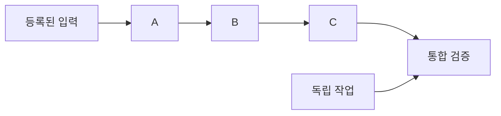

# 계약부터 다시 만든 Task Agent

기존 제품과 독립된 Node 24 + SQLite + Docker 실행 시스템이다. [계약](../docs/rebuild/contracts.md)을 기준으로 그래프, 변경 영향, 작업 공간, 중단·재개를 구현한다. 기존 제품의 코드·데이터·패키지를 가져오지 않는다. AX는 [설계 참고](../docs/rebuild/ax-reference.md)이며 실행 종속성이 아니다.

## 1. 실행하고 변경한다

Node 24 이상과 실행 중인 Docker daemon이 필요하다. 명령은 저장소 루트에서 실행한다. ARM64/AMD64 예제 이미지는 digest로 고정되어 있으며 최초 실행에 이미지 다운로드가 필요하다.

```sh
npm --prefix greenfield ci

node greenfield/cli/main.ts example --out /tmp/task-plan.json
node greenfield/cli/main.ts validate /tmp/task-plan.json
node greenfield/cli/main.ts apply /tmp/task-plan.json --operation initial --expected 0
node greenfield/cli/main.ts run example
node greenfield/cli/main.ts status example
node greenfield/cli/main.ts result example integration --out /tmp/task-result
```

`/tmp/task-result/data.json`의 예제 값은 105이다. 예제는 검증용 산술 그래프이며 자연어 목표를 계획하는 모델을 대신하지 않는다. `--state <절대 경로>`로 프로젝트별 상태를 분리할 수 있다. 같은 그래프를 다루는 모든 명령에 같은 경로를 사용한다. 기본 저장 경로는 `greenfield/.state/`다. 결과를 내보낼 디렉터리는 비어 있어야 한다.



입력을 변경할 때 새 graph revision을 만든다. `impact`는 영향 후보와 이유를 보여준다. 후보가 된 결과는 차단한 뒤 동일성·검증 증거에 따라 재사용, 재검증 또는 재실행한다.

```sh
node greenfield/cli/main.ts example --revision 2 --value 5 --out /tmp/task-plan-v2.json
node greenfield/cli/main.ts impact /tmp/task-plan-v2.json
node greenfield/cli/main.ts apply /tmp/task-plan-v2.json --operation source-v2
node greenfield/cli/main.ts run example
```

두 번째 결과는 113이다. A→B→C→통합만 다시 실행하고 D는 유지한다. `--expected`는 graph revision이 아닌 `status.stateRevision`이며 생략하면 현재 저장 revision을 사용한다. 재전송할 때 동일 `operationId`와 동일 `expectedRevision`·payload를 보내면 원래 명령 영수증을 돌려준다. graph 자체에는 별도 `revision/baseRevision`이 있다.

## 2. 중단·재개와 복구

```sh
node greenfield/cli/main.ts suspend example A
node greenfield/cli/main.ts run example
node greenfield/cli/main.ts resume example A
node greenfield/cli/main.ts run example
node greenfield/cli/main.ts events example --after 0
```

`suspend`는 중단 의도를 저장하고 종료 요청을 전달한다. 중단 명령 반환 자체가 종료·snapshot 완료를 뜻하지 않는다. `run`으로 저장된 intent를 조정하고 `status`에서 해당 attempt의 `phase: finished`를 확인한 뒤 재개한다. 다른 작업은 계속 실행할 수 있다. `all`로 활성 태스크 전체를 제어한다. `cancel` 후 다시 작업하려면 `retry`를 사용한다.

writer 종료를 증명하는 receipt와 불변 checkpoint를 확보해야 재개할 수 있다. 재개는 같은 논리적 공간을 복원한 **새 attempt·새 프로세스**다. 파일·완료 단계 digest를 보존하며, 프로세스 메모리나 열린 연결은 복원하지 않는다. 입력·계약·환경이 달라졌으면 과거 checkpoint로 이어가지 않는다.

제어기를 종료하거나 `run`의 시간 제한에 도달해도 컨테이너가 자동 취소되지는 않는다. 같은 `--state`로 `run`을 다시 실행하면 저장된 실행을 관측한다. 컨테이너 소실·종료 불명은 `unknown`으로 남겨 다른 writer를 시작하지 않는다. CLI exit code는 0(명령 처리/완료), 1(오류), 2(대기·실행 시간 제한)이다. `run --once`는 한 번만 조정하며 완료를 보장하지 않는다.

## 3. 계약과 설계 경계

| 경계 | 책임 | 구현 |
|---|---|---|
| 계약·그래프 | 정확한 revision, consumes/after/contains, 변경 영향·동일성 | `contracts/`, `kernel/` |
| 제어·보존 | 원자 명령/상태/이벤트/outbox, fence, 채택·증거, CAS | `control/`, `store/`, `artifacts/` |
| 실행·검증 | 독립 공간·읽기 전용 입력, 중단 receipt, checkpoint, 별도 검증 | `runtime/`, `validation/` |
| 제안·사용 | 계획 제안 검증과 실행 승인 분리, CLI | `planner/`, `cli/` |

작업 코드는 제어 DB, 다른 작업의 가변 공간, Docker socket에 접근하지 않는다. 검증은 중단된 출력 snapshot과 정확한 입력을 대상으로 수행한다. 명령 실행이 성공해도 계약 검증 전에는 결과로 채택하지 않는다. 조회 때도 채택 bytes·입력·검증 보고서의 무결성을 확인한다. 재검증이 불확실하거나 환경을 확인할 수 없으면 작업을 대기시키고 이유를 남긴다.

계획 입력은 `GraphBundle` JSON이다. 자연어 모델과 연결하려면 운영자가 선택한 `ProposalSource`를 주입한다. 원격 모델 계정이나 API 키는 기본 설정에 포함하지 않는다.

```sh
node greenfield/cli/main.ts plan --objective '목표' --proposal /tmp/proposal.json --out /tmp/review-plan.json
node greenfield/cli/main.ts plan --objective '목표' --command-argv /tmp/planner-argv.json --trusted-host-command --out /tmp/review-plan.json
```

`planner-argv.json`은 실행 파일과 인수의 JSON 배열이다. 명령은 목표와 현재 그래프를 stdin으로 받고 제안 JSON을 stdout으로 반환한다. 이 연결은 명시적으로 신뢰한 호스트 프로그램이며 컨테이너 작업의 격리 범위에 포함되지 않는다. 제안 결과는 자동 활성화하지 않는다. 검토한 파일에 `apply`를 실행한다.

첫 Docker backend는 `network: none`, secret 없음, 외부 효과 없음, 로컬 재실행 가능 단계를 지원한다. 제한적 외부 네트워크·secret·외부 효과 영수증이 필요한 작업은 `capability_unsupported`로 거절한다. snapshot은 일반 파일·디렉터리·권한·빈 디렉터리를 보존하며 symlink·special file은 거절한다. Node를 포함한 Linux 이미지와 root source snapshot 하나를 지원한다. 자세한 근거는 [실행 기반 결정](platform-decision/README.md), [runtime](runtime/README.md), [validation](validation/README.md), [planner](planner/README.md)에 둔다.

## 4. 검증 근거

```sh
npm --prefix greenfield run check
npm --prefix greenfield run test:docker
node docs/rebuild/validate-plan.mjs --self-test
```

기본 suite는 Docker가 필요한 검증을 명시적으로 skip한다. `test:docker`는 실제 daemon에서 격리, 중단·재개, 독립 검증, 선택 재작업과 제어기 SIGKILL 복구를 실행한다. 테스트가 만든 namespace의 자원만 정리한다. 일반 작업의 공간·컨테이너·증거는 보존하며 자동 GC와 운영 UI는 포함하지 않는다.

구현 태스크·계약·수용 시나리오별 증거와 미검증 범위는 [구현 상태](../docs/rebuild/implementation-status.md)에 기록한다. 고정 fixture의 통과를 자연어 모델의 계획 품질 검증으로 간주하지 않는다.
